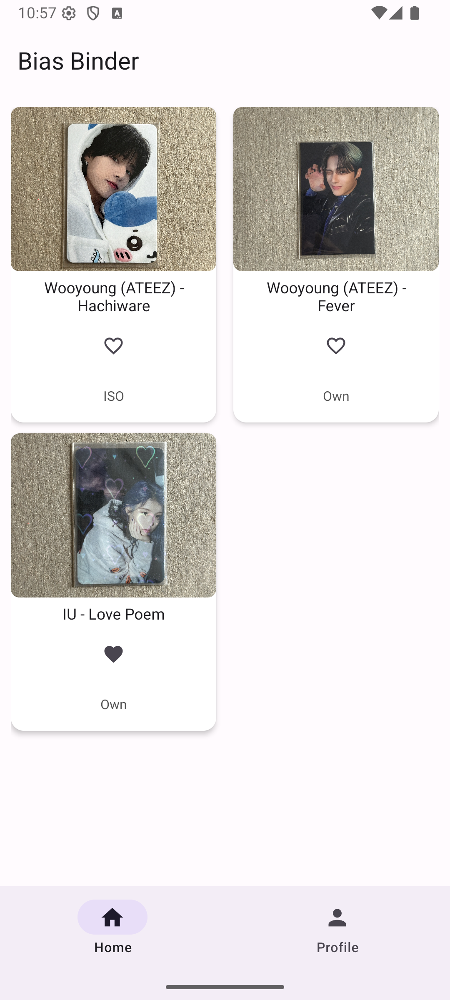
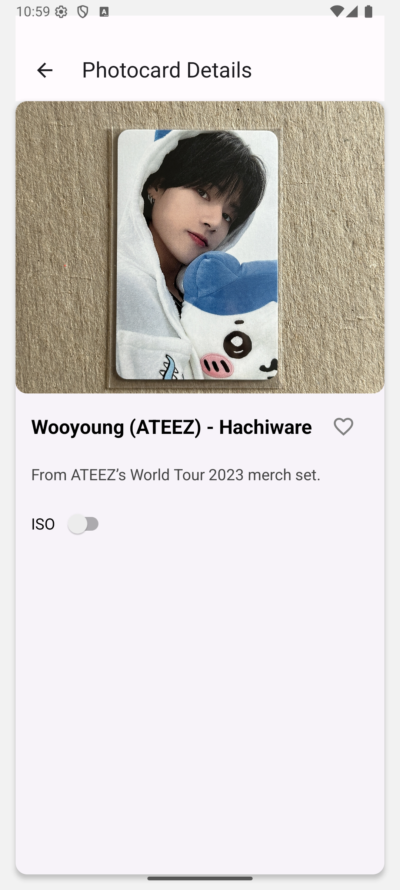
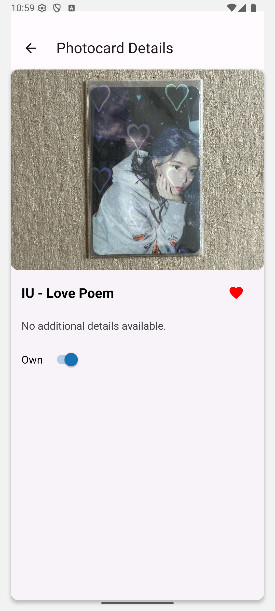
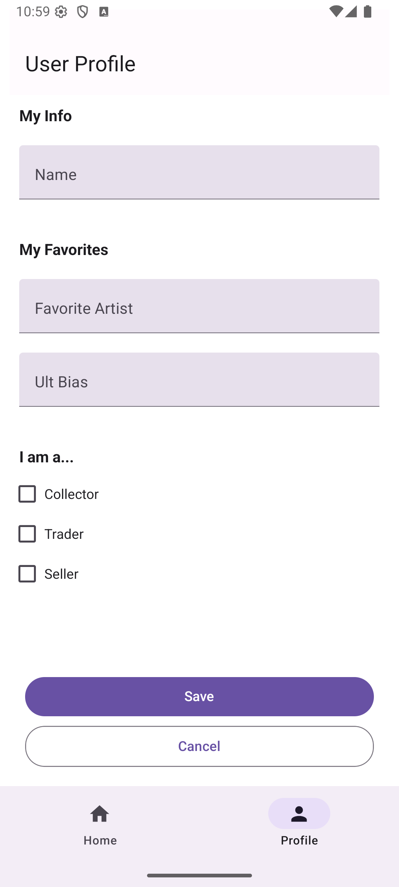
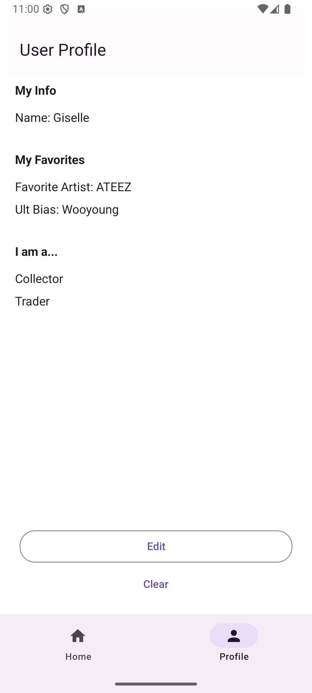
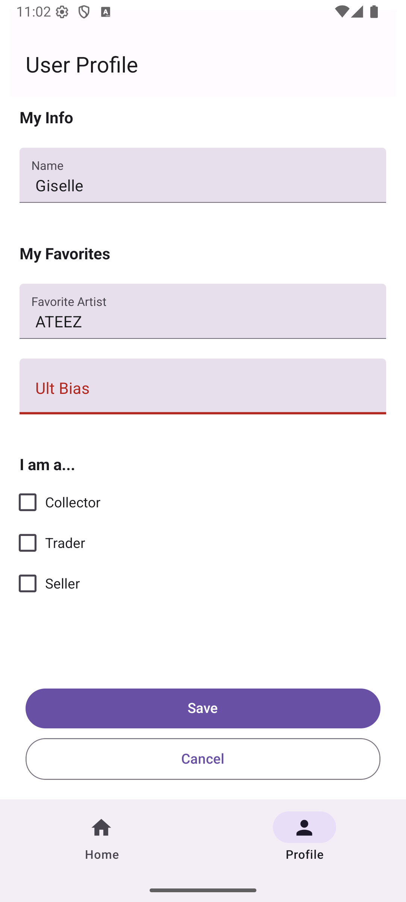

# Assignment 3: Photo Gallery App

INFO 670 Cross-Platform Mobile Development

Giselle Rosales

## Design & Purpose

**Bias Binder** is a themed photo gallery app designed specifically for K-pop fans who collect photocards. The app allows users to digitally organize, track, and showcase their photocard collections in a structured and visually engaging way. Inspired by the concept of physical binders, Bias Binder helps collectors keep track of their collection by displaying each photocard with further details about its origin and set if applicable.

The app’s target audience includes K-pop enthusiasts—especially photocard collectors—who want a simple, mobile-friendly solution to catalog their items, manage wishlists, and visualize their collecting goals on the go. The app combines the functionality of a gallery viewer with features tailored to fandom-based collecting habits.

## Walkthrough

The **Home Screen** displays all photocards:
- Own: Photocards they own
- ISO: "In Search Of," i.e., photocards on their wishlist
- Hearted: Indicating a card as favorite, regardless if owned or not.

Click a photocard to read more details about it on the **Viewing Page**.
Here users can favorite/unfavorite the card by tapping on the heart.
They can also use the ISO/Own toggle to declare if they own the card or are looking to collect it.

 

On the **User Profile** page, personal information--their name name, favorite group/solo artist, ult bias (ultimate favorite idol/member of group), and their collection focus--can be saved, edited, and cleared.

 

If an input box is left blank, **error handling** prevents the information from saving empty strings:

## Future Steps

While Bias Binder is currently functional, the collection (photocards and their details) is hard-coded. In the future, I'd like to implement further features that would greatly enhance the K-pop fan's collecting experience:
- Adding user-submitted photos to display on the Home Screen
- Filtering the collection using a dropdown menu to display photocards that the user owns, ISO, or favorited
- Displaying their collection progress using a progress bar
- (Stretch) Connecting to a database that stores photocard templates (of members, full sets, etc.) and more details about photocard information