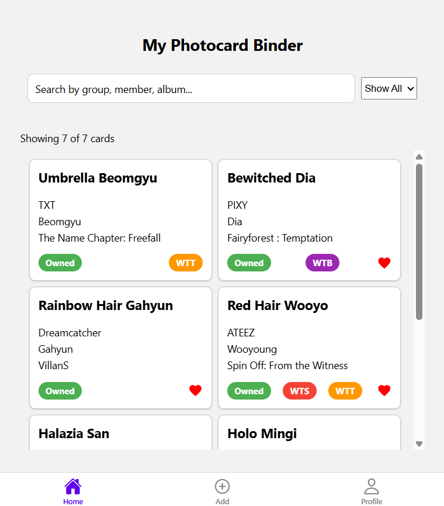
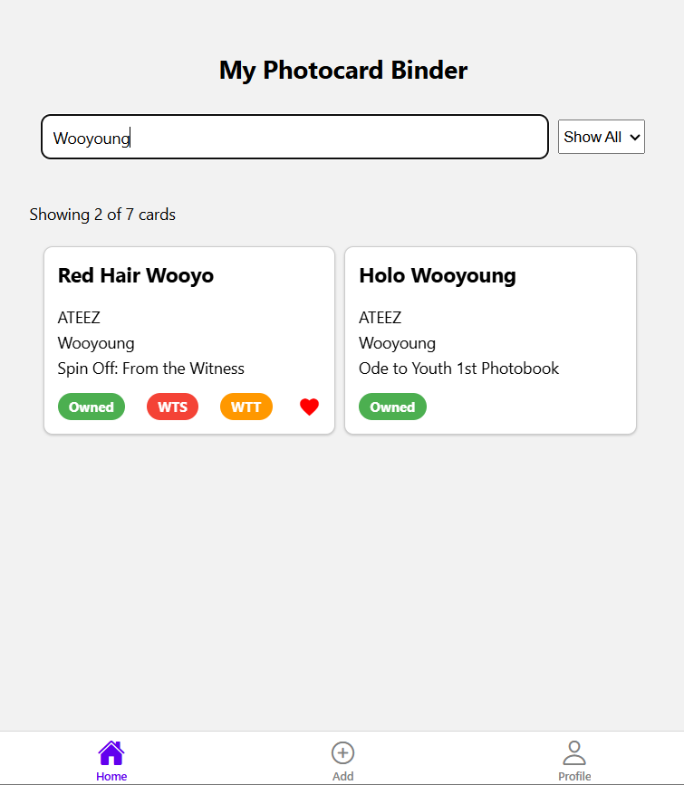
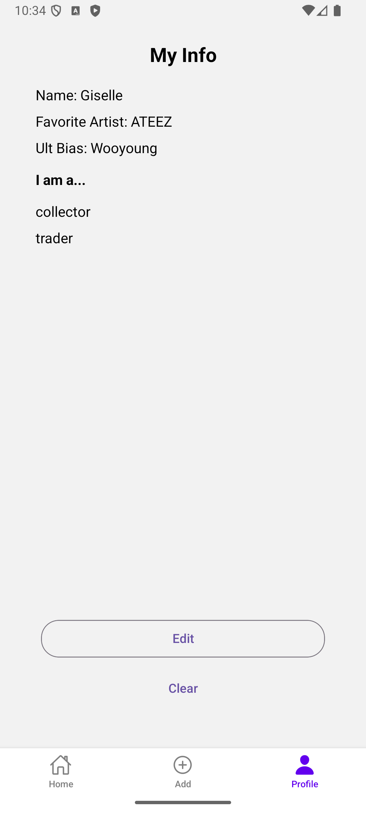

# Final Project: Bias Binder (expanded)

INFO 670 Cross-Platform Mobile Development

Giselle Rosales

## Design & Purpose

**Bias Binder** is a mobile app designed for K-pop fans who collect photocards. It provides a digital solution for organizing, tracking, and showcasing photocard collections in a clean, structured, and visually engaging way.

The app empowers users to:
- Log and categorize their cards
- Tag items as owned, in search of (ISO), for sale/trade, etc.
- Filter and search through their collection with ease

**Target Audience**:
Bias Binder is built for K-pop enthusiasts—especially photocard collectors—seeking a mobile-friendly, intuitive tool to catalog their items, manage their buy/sell/trade interests, and visualize collection progress. It merges the utility of a personal inventory manager with the community-centered needs of fan-driven collecting habits.


## Walkthrough

Below is a quick walkthrough of **Bias Binder**, showcasing key screens and functionality. Due to network security issues to Drexel's server, screens that require network connectivity are shown here in browser rather than mobile.

### 1. 📂 View & Filter Your Photocard Collection  
Displays a dynamic list of photocards retrieved from the database with most recently added ordered first, along with a total count of all cards and those currently shown (based on filters). Users can filter by tags (All, Owned, ISO, Favorites) or search by keyword.  
  

### 2. ➕ Add New Photocards  
Users can add new photocards to their collection using a clean input form. Each entry is stored in the database and immediately visible in the list view.  
 

### 3. 🛠️ Edit or Delete Photocard Entries  
Photocards can be edited or deleted at any time. Users can update card info, ownership, and tag status (e.g., WTS, WTT, WTB).  


### 4. 🙋‍♀️ Customize Your Profile  
Users can personalize their profile by entering and saving their name, favorite artist, ult bias, and collector roles. This data is saved with persistent secure storage.  
 

### 5. 🏷️ Tag & Search Cards  
Photocards can be tagged with buy/sell/trade labels (WTS, WTT, WTB), making it easy to manage trading activity. The photocard list updates dynamically when filters or edits are applied.  


## Server API Design & Specification

Bias Binder uses a set of PHP-based API endpoints to connect the mobile frontend with the backend SQLite database (`photocards.db`). Each endpoint supports a specific operation and uses the `GET` method due to school server constraints.

### 📥 `add_photocard.php`

**Purpose:**  
Add a new photocard entry to the `binder` table.

**Method:** `GET`

**Parameters:**  
- `label` (string): Card title or identifier  
- `artist` (string): Group name  
- `member` (string): Idol name  
- `album` (string): Album name  
- `favorite` (0 or 1)  
- `owned` (0 or 1)  
- `wts` (0 or 1): Willing to Sell  
- `wtt` (0 or 1): Willing to Trade  
- `wtb` (0 or 1): Willing to Buy  

**Example Call:**  
https://www.cs.drexel.edu/~gr539/final-project/backend/add_photocard.php?label=wooyo&artist=ateez&member=wooyoung&album=ghpt2&favorite=0&owned=1&wts=1&wtt=0&wtb=0


**Example Response:**  
```json
{"success":true,"message":"Photocard added!"}
```

---

### 📤 `get_photocards.php`

**Purpose:**  
Retrieve all photocards stored in the database.

**Method:** `GET`

**Parameters:** None

**Example Call:**  
https://www.cs.drexel.edu/~gr539/final-project/backend/get_photocards.php


**Example Response:**  
```json
[
  {
    "id": 7,
    "label": "wooyo",
    "artist": "ateez",
    "member": "wooyoung",
    "album": "ghpt2",
    "favorite": 0,
    "owned": 1,
    "wts": 1,
    "wtt": 0,
    "wtb": 0
  }
]
```

---

### ✏️ `edit_photocard.php`

**Purpose:**  
Update an existing photocard's information.

**Method:** `GET`

**Parameters:**
- `id` (int): Unique photocard ID
- `label` (string): brief description of the photocard
- `artist` (string): name of group/soloist
- `member` (string): name of idol(s) in photocard
- `album` (string): name of album or set for which photocard was printed
- Other optional fields to update: `favorite`, `owned`, `wts`, `wtt`, `wtb`

**Example Call:**  
https://www.cs.drexel.edu/~gr539/final-project/backend/edit_photocard.php?id=18&label=hachiware+wooyo&artist=ateez&member=wooyoung&album=ghpt2&favorite=0&owned=1&wts=1&wtt=0&wtb=0

**Example Response:**  
```json
{"success":true,"message":"Photocard updated"}
```

---

### 🗑️ `delete_photocard.php`

**Purpose:**  
Delete a photocard from the database.

**Method:** `GET`

**Parameters:** 
- `id` (int): Unique photocard ID

**Example Call:**  
https://www.cs.drexel.edu/~gr539/final-project/backend/delete_photocard.php?id=18


**Example Response:**  
```json
{"success":true,"message":"Photocard deleted"}
```

These endpoints enable full **CRUD** functionality (Create, Read, Update, Delete) for managing the photocard collection in Bias Binder.

## 📂 Database Schema

This app uses a SQLite database named `photocards.db` to store user-added photocard data in a single table called `binder`.

### Table: `binder`

| Column Name | Type    | Description                                          |
|-------------|---------|------------------------------------------------------|
| `id`        | INTEGER | Primary key. Auto-incremented unique identifier.     |
| `label`     | TEXT    | Custom label for identifying the photocard.          |
| `artist`    | TEXT    | Name of the K-pop group or solo artist.              |
| `member`    | TEXT    | Specific member featured on the photocard.           |
| `album`     | TEXT    | Album or era the photocard comes from.               |
| `favorite`  | INTEGER | Boolean value (`0` or `1`) for marking as favorite.  |
| `owned`     | INTEGER | Boolean value (`0` or `1`) for indicating ownership. |
| `wts`       | INTEGER | Boolean (`0` or `1`). Willing to Sell.               |
| `wtt`       | INTEGER | Boolean (`0` or `1`). Willing to Trade.              |
| `wtb`       | INTEGER | Boolean (`0` or `1`). Willing to Buy.                |

### Notes:
- All `BOOLEAN` fields are stored as integers (`0` = false, `1` = true).
- This schema supports the app’s core features: tagging, filtering, and managing photocards based on collection and trade status.
- Future expansions can include fields for `image`, `price`, or `condition`.

This schema ensures a lightweight yet flexible structure for mobile-friendly CRUD operations via API calls.

## 💡 Experiences

### Challenges & Issues

This project began with code reused from Assignment 3 (A3), which I initially thought would make feature expansion easier. However, I quickly realized that some lingering issues in the original code—though acceptable for A3—created unexpected complications for the final project. 

To address this, I had to **clean up and simplify the codebase**, refactoring several components to ensure consistency and maintainability. One of the biggest trade-offs was sacrificing parts of the existing UI design and shelving some of my enhancement ideas in order to **prioritize functionality**—specifically, making sure that API calls and database interactions worked reliably.

---

### Best Practices & Techniques

With guidance from **Dr. Ke**, I adopted the strategy of **isolating and debugging individual code units**, testing them one by one before adding new features. This “build-on-stable-ground” approach helped me catch and resolve bugs early and maintain code stability throughout development.

Some best practices I applied:

- **Minimum Viable Product (MVP) mindset**  
  I stayed focused on the core project goals: building a basic UI, implementing server API calls, and integrating a database. This helped me stay within scope and manage my time efficiently.
  
- **Component-based architecture**  
  I created a `components` folder to house custom UI components—most notably, the `PhotocardList`—to keep screens like `HomeScreen.js` clean and modular. This structure makes future scaling and debugging easier.

- **Consistent styling**  
  I used an external `StyleSheet.js` file to centralize styling, ensuring a consistent look and feel across the app. I leveraged both **React Native core components** and **React Native Paper** for a polished interface.

- **Well-documented code**  
  I included detailed **comments throughout the codebase** so that both current and future developers (including myself) can easily understand the function of each block of code.

---

### 🚀 Future Plans

I plan to revisit and implement the advanced UI features I initially ideated. These include:

- 📊 A **progress bar** to visualize collection completion
- 🖼️ Support for **adding photocard images**
- 💱 A dedicated **Buy/Sell/Trade tab** to centralize all BST-related information (e.g., pricing, tags, filters)

These enhancements would further personalize the app for K-pop photocard collectors and provide more value as a collection management tool.

---

Overall, this project pushed me to balance **design thinking with technical execution**, and I gained valuable experience in **debugging, API integration, and modular development** along the way.
