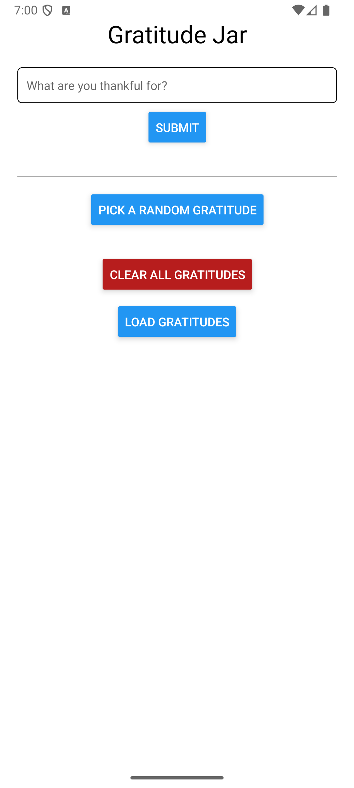
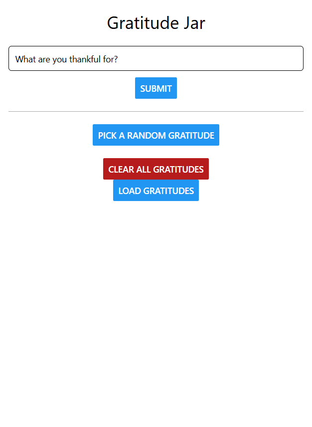
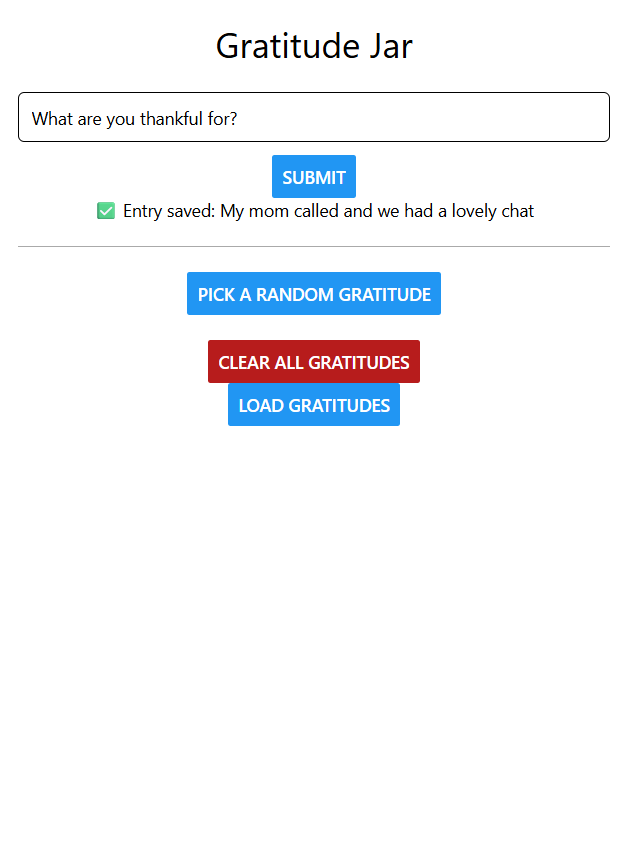
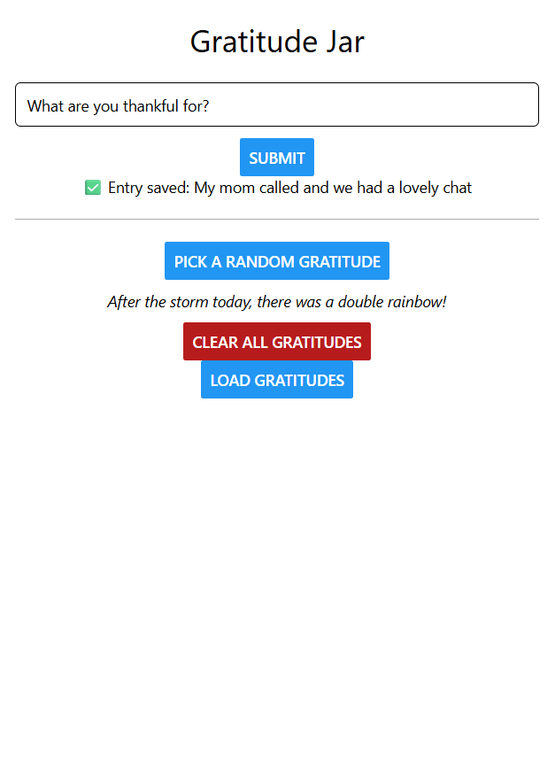
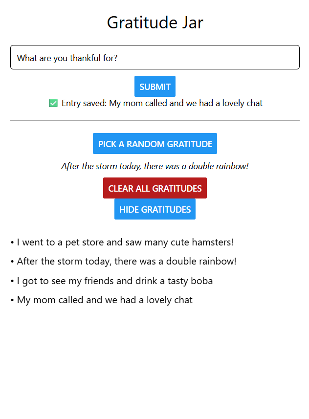
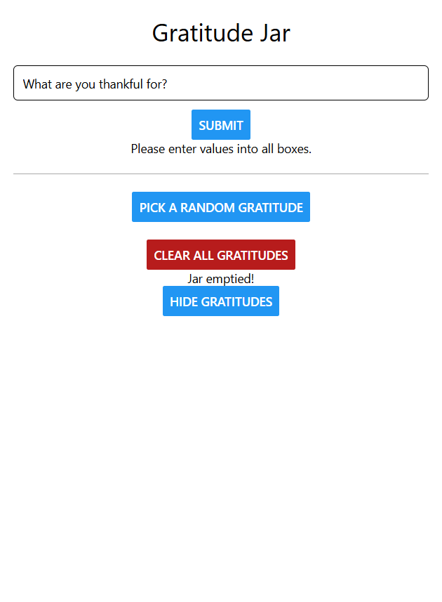

# Assignment 4: React Native and Server APIs

INFO 670 Cross-Platform Mobile Development

Giselle Rosales

## Design & Purpose

**Gratitude Jar** is a simple mindfulness app designed for users who want to cultivate gratitude and reflect on positive moments. Users can “add a note” to their digital jar by submitting a gratitude entry, which is then stored in a database. On tougher days, they can randomly “pick a note” from the jar to be reminded of something that once brought them joy. The app offers a gentle and personal way to build a habit of reflection and emotional well-being.

## Walkthrough

**Note**: Gratitude Jar was developed as a mobile app; however, due to network security restrictions on Drexel’s server, it currently functions in web browser mode only. The following walkthrough showcases the app’s features as seen in the web version. Please note that the UI may differ slightly from the intended mobile experience.

### Submitting an Entry

Users can type a gratitude note into the text box and press the Submit button to save it. The entry is then stored in the database for future retrieval.

### Pick a Random Gratitude

By clicking this button, users can draw a random note from their digital jar to reflect on – a helpful reminder for moments when they need a mood boost.

### Load Gratitudes

This button displays all saved gratitude entries in a scrollable list, allowing users to browse their past reflections. Once clicked, the button toggles to "Hide Gratitudes” allowing users to collapse the list and keep the screen uncluttered.

### Clear All Gratitudes

Pressing this button clears all entries from the jar, permanently deleting them from the database.

## Server APIs & Database (Back-end)

### API Endpoints

- **`add_gratitude.php`** — Adds a new gratitude entry  
  - **Parameters:** `thankful` (string): The gratitude text to save  
  - **Response:** Plain text confirmation message – “Entry Saved!”

- **`get_gratitudes.php`** — Retrieves all gratitude entries  
  - **Parameters:** None  
  - **Response:** JSON array of gratitude strings  

- **`get_random_gratitude.php`** — Retrieves a single random gratitude entry  
  - **Parameters:** None  
  - **Response:** JSON object with a `thankful` field  

- **`clear_gratitudes.php`** — Deletes all gratitude entries from the database  
  - **Parameters:** None (uses POST method for safety)  
  - **Response:** JSON object indicating confirmation – “Jar emptied!”

### Database

The app uses a SQLite database to store gratitude entries persistently. It contains a single table:

| Field    | Type                         | Description                         |
| -------- | ---------------------------- | --------------------------------- |
| `id`     | INTEGER PRIMARY KEY AUTOINCREMENT | Unique identifier for each entry |
| `thankful` | TEXT                       | The text content of the gratitude entry |

This schema allows easy insertion, retrieval, and deletion of entries through the API.

## Future steps

This first version of Gratitude Jar offers basic functionality focused on saving and viewing entries. Future iterations could enhance the experience by:
- Improving the app’s visual design with calming, welcoming themes
- Adding more user-friendly features, such as deleting individual entries or editing submitted notes
- Expanding functionality with advanced options like categorizing entries, organizing them into lists, and incorporating jar/note imagery with animations for a more immersive experience
