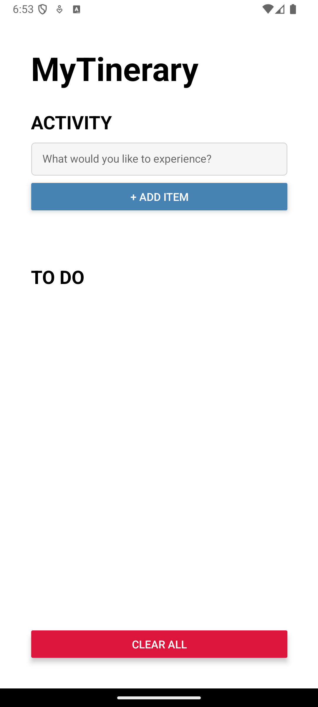
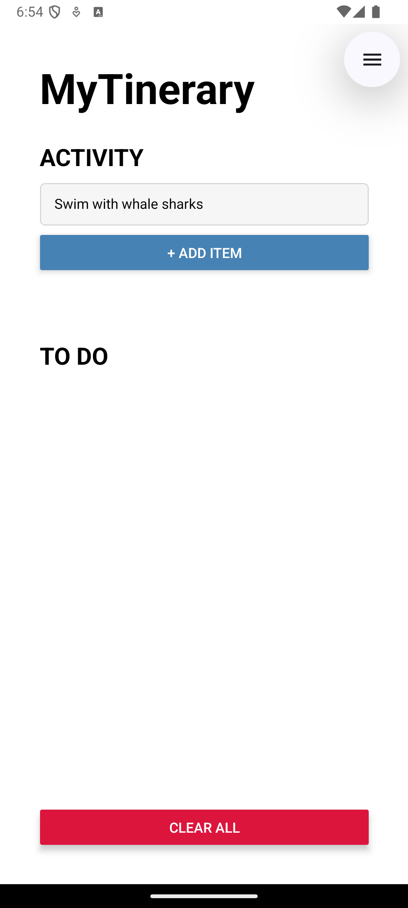
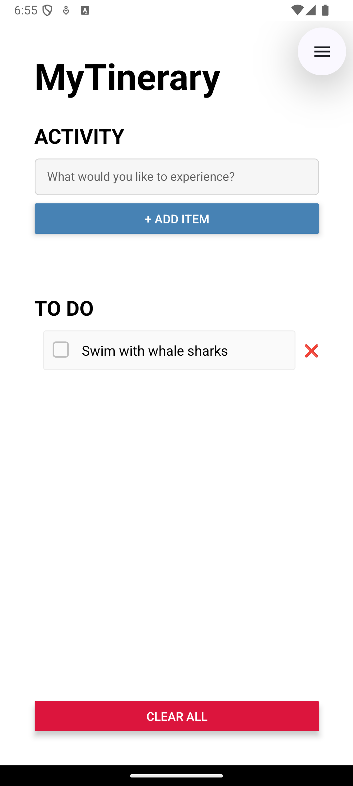
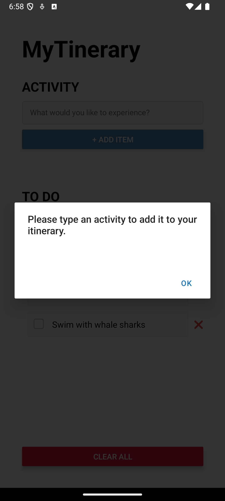
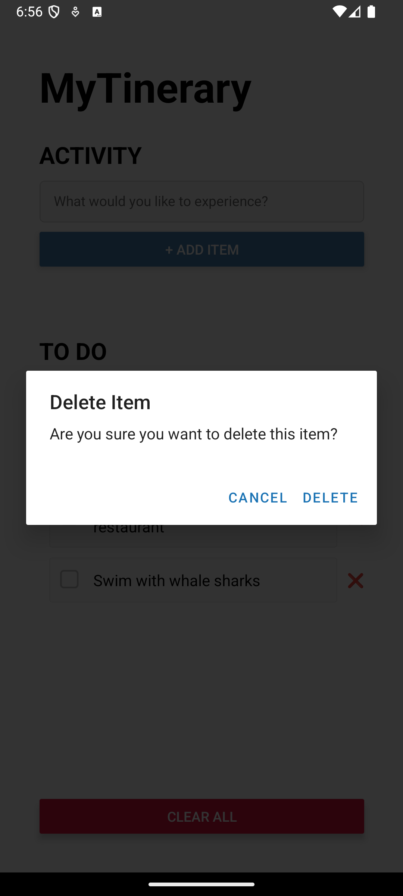
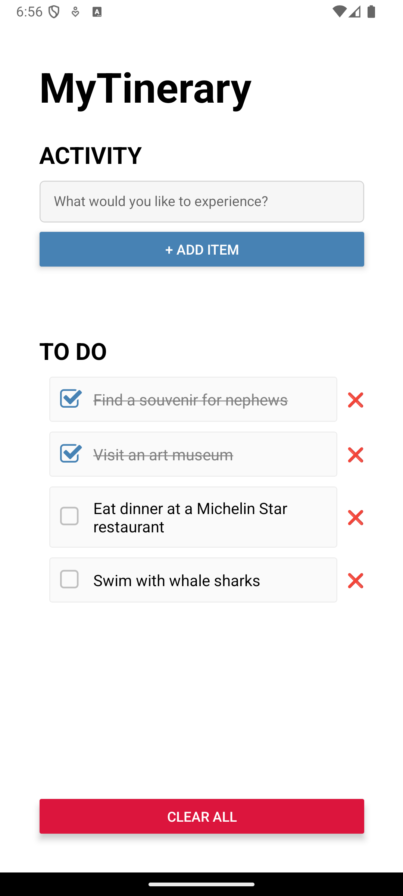
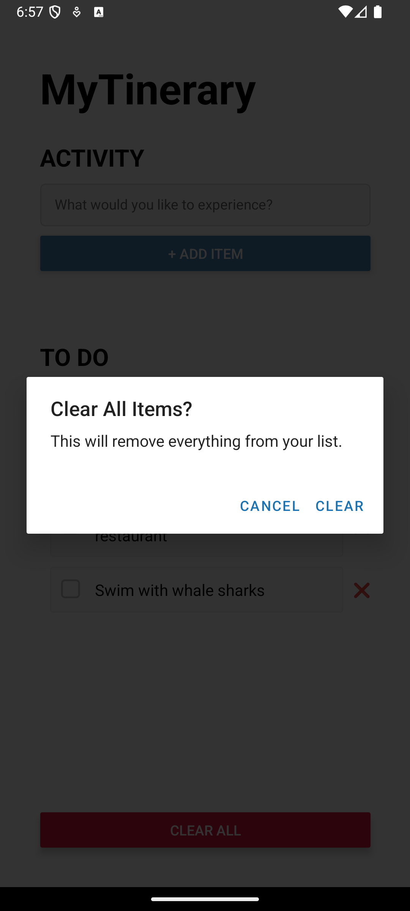

# Assignment 2: List App

INFO 670 Cross-Platform Mobile Development

Giselle Rosales

## Design & Purpose

**MyTinerary** is a list-based app designed for travelers to plan and organize their upcoming trips. It allows users to create a personalized itinerary of activities they want to experience at their destination. Ideal for planners and list-lovers, MyTinerary helps users stay on track during their travels and ensures they don't miss out on anything they’ve planned!

## Basic Use

Users can build their itinerary by adding and deleting items, marking items as complete, or restarting with a blank list.

The app starts with an empty itinerary.

**Add item** – Type into the text input box and tap the + Add Item button. The activity will appear in the To-Do list below.

 

Adding an empty item will result in an error dialog.

**Delete item** – Remove a single item by tapping the ❌ next to it. Confirm deletion in the dialog box.

**Check/uncheck item** – Mark an activity as complete by tapping the checkbox. Tap it again to uncheck. Completed items appear grayed out and crossed off.

**Clear entire list** – Tap the Clear List button to remove all items. Confirm deletion in the dialog box.

